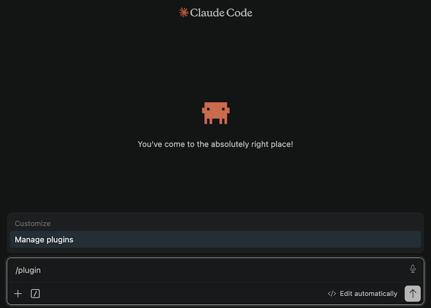
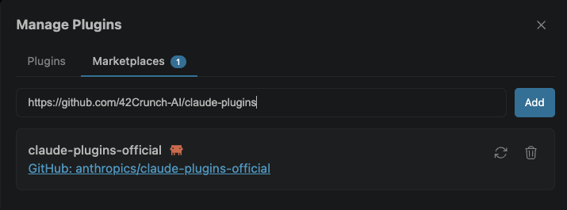
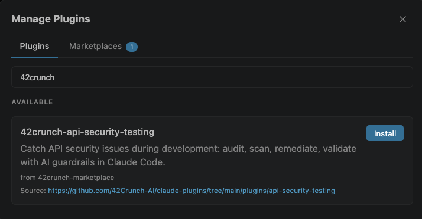
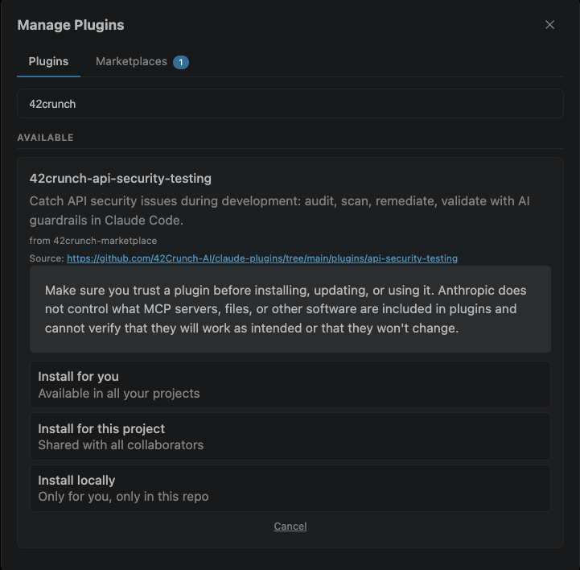
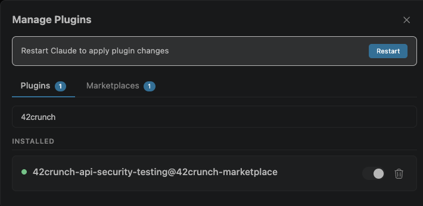

# 42Crunch Claude Plugins

The official [42Crunch](https://www.42crunch.com) plugin marketplace for Claude Code — a catalog of AI-powered plugins that bring 42Crunch's API security capabilities directly into your Claude Code workflow.

42Crunch plugins give Claude the ability to audit OpenAPI specs, scan live APIs for vulnerabilities, and apply fixes to ensure APIs meet security guardrails.

## Structure

```
.claude-plugin/
  marketplace.json              # Plugin registry manifest
docs/                           # Repository-level documentation assets
  images/                       # Screenshots and diagrams used in READMEs
plugins/                        # Claude plugins developed by 42Crunch
  api-security-testing/
    .claude-plugin/
      plugin.json               # Plugin metadata
    skills/                     # Skill definitions
    references/                 # Reference definitions
    README.md                   # Documentation
    LICENSE                     # License
```

## Prerequisites

The [Claude Code CLI](https://docs.anthropic.com/en/docs/claude-code/getting-started) is required to add marketplaces and install plugins using the `claude` CLI commands below.

## Adding this Marketplace

Register the 42Crunch marketplace with Claude Code:

#### Using Claude Code CLI

```
claude plugin marketplace add https://github.com/42Crunch-AI/claude-plugins
```

#### Or Using an interactive Claude Code session

```
/plugin marketplace add https://github.com/42Crunch-AI/claude-plugins
```

#### Or Using Claude Code (for VSCode) plugin manager

1. Type `/plugin` and press **Enter** to open the plugin manager:



2. On the **Marketplaces** tab, paste the 42Crunch marketplace URL:
  - `https://github.com/42Crunch-AI/claude-plugins`
  - Click **Add** to add the marketplace



## Available Plugins

### [42crunch-api-security-testing](./plugins/api-security-testing/)

AI-powered API security plugin backed by 42Crunch. Audit OpenAPI specs, detect OWASP API Security vulnerabilities (including BOLA/BFLA), run live conformance and authorization scans against running APIs, and apply AI-assisted fixes — all through natural language.

**Install:**
After registering the marketplace (see above), install the plugin:

#### Using Claude Code CLI

```
claude plugin install 42crunch-api-security-testing@42crunch-marketplace
```

#### Or Using an interactive Claude Code session

```
/plugin install 42crunch-api-security-testing@42crunch-marketplace
```

#### Or Using Claude Code (for VSCode) plugin manager

1. On the **Plugins** tab, search for the 42Crunch plugin:
  - Type '42crunch' in the search bar
  - Click **Install** on the `42crunch-api-security-testing` plugin



2. Choose the **scope** of the plugin installation (User, Project, Local):



3. Click **Restart** to apply the changes:



See the [plugin README](./plugins/api-security-testing/README.md) for full documentation and [RECIPES.md](./plugins/api-security-testing/RECIPES.md) for common scenario guides.


## Links

- [42Crunch](https://42crunch.com/)
- [42Crunch Documentation](https://docs.42crunch.com)
- [42Crunch on GitHub](https://github.com/42Crunch)
- Support: support@42crunch.com
